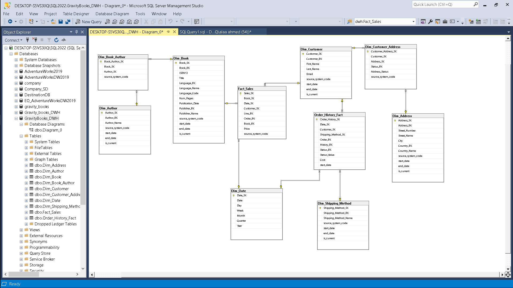
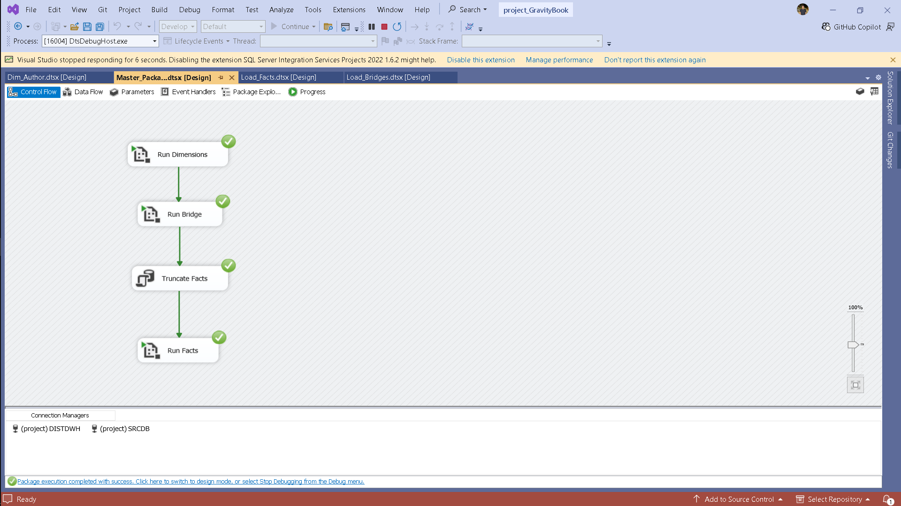
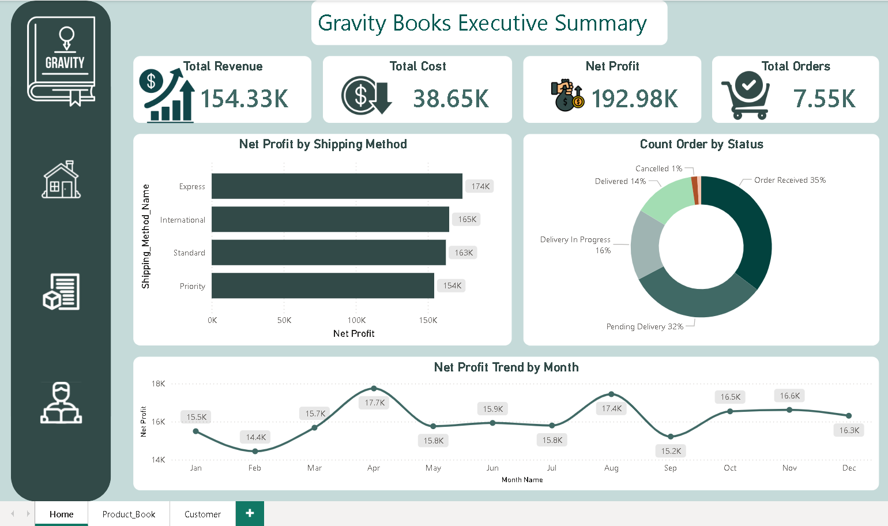

# 📚 Gravity Books - End-to-End Data Engineering & BI Project

## 📌 Project Overview
This project is a complete **End-to-End Data Engineering and Business Intelligence solution** designed for a fictional bookstore, "Gravity Books". The objective was to extract data from a highly normalized transactional database, transform it into a dimensional model, load it into a Data Warehouse, and visualize the insights using Power BI.

## 🏛️ Data Architecture & Modeling
The Data Warehouse was built using a hybrid **Galaxy & Snowflake Schema** approach to handle complex business logic and multiple fact tracking.

* **Two Fact Tables:** * `Fact_Sales`: A transactional fact table recording the actual sales revenue.
  * `Order_History_Fact`: An accumulating snapshot fact table tracking the lifecycle and shipping cost of each order independently.
* **Bridge Tables:** Used to resolve many-to-many relationships, such as `Dim_Customer_Address` and `Dim_Book_Author`.

> **ERD Diagram:**
> 

## ⚙️ ETL Pipeline (SSIS)
The ETL pipeline was developed using **SQL Server Integration Services (SSIS)** with a strong focus on reliability and performance.

### Key Technical Highlights:
1. **Parallel Execution:** Dimension packages were designed to run in parallel where dependencies allowed, significantly reducing processing time.
2. **SCD Type 2:** Implemented Slowly Changing Dimensions (Type 2) to maintain historical data for customer addresses and author details.
3. **Idempotency:** The pipeline is fully idempotent. An `Execute SQL Task` was added to `TRUNCATE` fact tables before loading, preventing data duplication upon rerunning.
4. **Master Package Orchestration:** A Master Package controls the precise execution order (`Dimensions` ➜ `Bridges` ➜ `Facts`) to ensure data integrity.

> **Pipeline Orchestration:**
> 

## 📊 Business Intelligence & Visualization
The final layer of the project is an Executive Power BI Dashboard designed with modern Card UI principles to answer key business questions.

### DAX Implementations:
* Isolated **Delivered Cost** from pending/cancelled orders using `CALCULATE` to reflect accurate real-world logistics costs.
* Calculated precise **Net Profit** metrics across different shipping methods and time periods.

> **Executive Dashboard:**
> 

## 📁 Repository Structure
* `/SQL_Scripts`: DDL scripts for creating the staging area and Data Warehouse tables.
* `/SSIS_Packages`: The visual ETL workflows containing data transformations and lookups.
* `/Images`: Screenshots of the architecture, data flows, and final dashboard.

---
*Developed by [Alaa Ahmed]*
